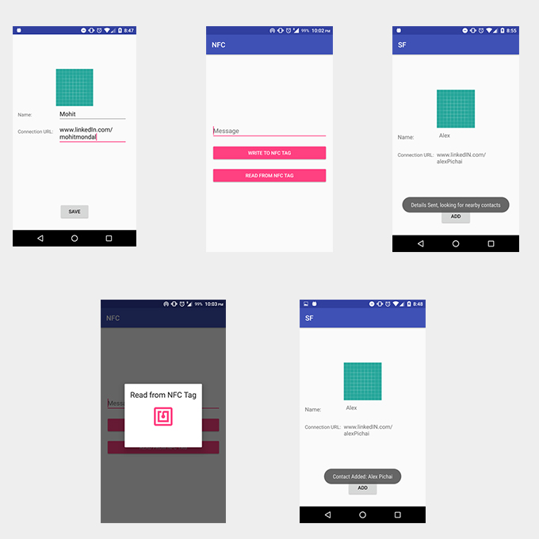

# Self App

Android App that allows you to quickly exchange your profile by just tapping your phone (using NFC) to facilitate the networking process.

Screenshots
-------------

 

Getting Started
---------------

This sample uses the Gradle build system. To build this project, use the
"gradlew build" command or use "Import Project" in Android Studio.

Pre-requisites
--------------
Self is currently built to work with Android 26 (8.0 Oreo). However, Egg's minimum SDK support is 18 (4.3 Jelly Bean).

- Android's phone must have and NFC reader
- Android SDK 26
- Android Build Tools v26.0.1
- Android Support Repository

Support
-------

If you've found an error in this sample, please file an issue:
https://github.com/funkymonk161994/SF-FinalProject/issues

Patches are encouraged, and may be submitted by forking this project and
submitting a pull request through GitHub.
